# 骑行记事

6.26-7.06

## 前言

***

​	骑行结束后的一段时间里,不断想起在蒙阴的小溪里踩着鹅卵石淌水的情景,想起到达海边时的兴奋,想起在黄岛逮螃蟹的快乐,又回忆起在沂源一亭子下睡午觉的悠然······那好像是一场梦,忘掉了所有的劳累与艰难,留下的全都是那美好的回忆.

雖千萬裏,吾往矣!

​										———题记

## 骑行前准备

***

​	放暑假前大概一两个月,便有了想去骑车去日照的想法.但因中考即将来临,并无时间,也只是想想罢了.

​	中考结束后几天,便又重提了这一件事,于是便开始着手准备,到了临近的前几天,人数确定了下来,加上我也只有两个人.那个人是我同学,我俩以前就是经常在一起探险,所有这次也只能是我俩了.

​	中考结束后,他一直在补课,他父母因为这也不愿让他去.临出发前一天,他去补课班请了假.但是直到傍晚也没有说服他父母.

​	另一个困难便是天气,因为我们行程的那几天要连下三天的雨,会带来诸多的不便.

​	临走的那天凌晨五点,我起床,只见窗外大雨倾盆,我给他发了条短信,说今天估计走不了了.七八点钟,他打来电话,说雨停了赶紧走.本一位走不了的我并没有收拾东西.只得赶紧收拾下就走了.

​	我们不再管雨是否会再下.反正走就走吧.

## 第一日,雨中出发

***

​	收拾好东西后,绑在自行车货架上,便走了.十点多钟,刚开始还是些小雨,才过几分钟,忽地就下大了.豆大的雨珠从天空砸下,使我们不得不赶紧找个避雨的地方.在一屋檐下,换上雨衣,又继续走了.

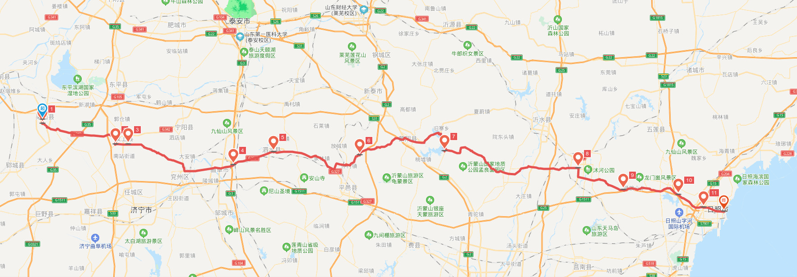

​	骑车的时候穿雨衣并不太管事,只能护住上身,至于裤子和鞋,刚走没多大会就已经湿透了.大概起了二十多公里,雨几乎不下了,只剩些蒙蒙细雨.脱掉雨衣,任雨点打在身上,凉凉的,也怪舒服的.

​	我们没有驮包,只是将背包绑在货架上,时间一长,便出现了一个问题-----绳子便松了.原本牢固的背包也是左歪右斜,只好紧紧绳子再继续走.差不多将近十二点钟的时候,到了汶上,在城边一小餐馆内简单的吃点之后,便又上路了.

​	刚开始一切顺利,刚吃完饭,悠闲地骑行在柏油路上,路两旁尽是些柔美清秀的垂柳,在风的吹拂下随意飘荡着.

​	忽然天就变暗了,大雨马上便倾盆而下,我们赶紧穿上雨衣,尽管如此,裤子和鞋也是很快就湿了.等雨小点,继续骑上车子,往下一个目的地前进.大概在下午五六点钟的时候,到达了曲阜,在当地找了一家宾馆,便安顿了下来.

​	在宾馆,忽然发现,同伴的书包全部湿透了,衣服和鞋也湿了.我的背包也湿了,但并无大碍,因为我在背包外裹了一层雨衣.

​	傍晚,呼吸着雨后清新的空气,漫步在街头.去了商场,买了双拖鞋,以防止将鞋弄湿.

​	睡前洗洗晾晾衣服,吃些水果再洗个澡,真是惬意.

​	晚上一定要休息好去进行明天的旅程.

## 第二日,午后进群山

***

​	一大早起来,天正在下雨,去周边的早餐摊吃点饭,收拾收拾东西,便又出发了.

​	虽然起得早,但走的并不早,大概九点半了,我们才出发,以至于那天上午只走了二十多公里的路,也真是无语了.

​	中午到了泗水,在那儿喝了碗牛肉汤后,雨便又下了起来.

​	因为昨天同伴的码表进水报废,所以又先去买了个码表又继续走的.	

​	雨没下多久便停了,在一条路的拐角处,我们看到了一个路牌,上面写着到日照还有二百多千米.虽然仅仅是一个路牌,但至少让我们看到了希望,拍个照留念下,便又前进了.

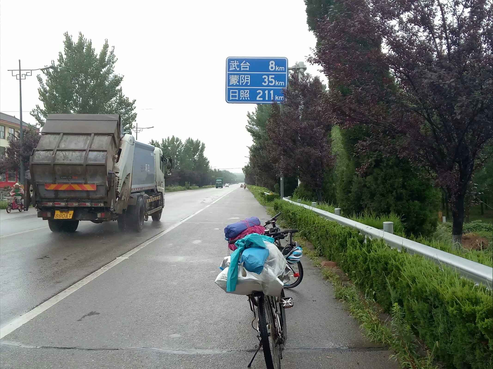

​	在这之后,我们就一头栽进了大山里.

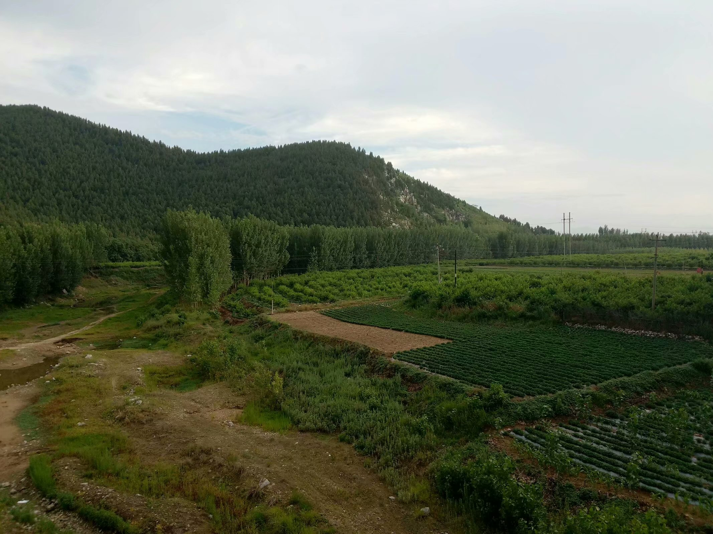

​	爬坡异常艰难,仿佛要使出吃奶的力气.路上几乎没车,我们骑着车子左拐右拐走S型,以便省些力气.

​	周围风景是很不错的,蓝天白云,青山绿树,每次在蹬不动的时候,都会看到下坡就在眼前.

​	下坡速度很快,戴上墨镜和面罩,也能感受到风在击打着脸颊.时速上到五六十,都是很正常的.

​	大概下午五点多钟,到达了蒙阴.听说蒙阴炒鸡很有名,便在吃饭时特意点了一盘炒鸡.

​	吃完饭后,去附近五金店买了些细铁丝,好来绑我那并不怎么牢固的货架.

​	夕阳无限好,只是近黄昏.通红的晚霞在落日旁边掩映着.东方的天空还有些蓝色和紫色的云彩.天色渐渐暗下来,室友西方还存有些余光,渐渐地,西方的那点余光也没有了,只能看到一小弯月亮.

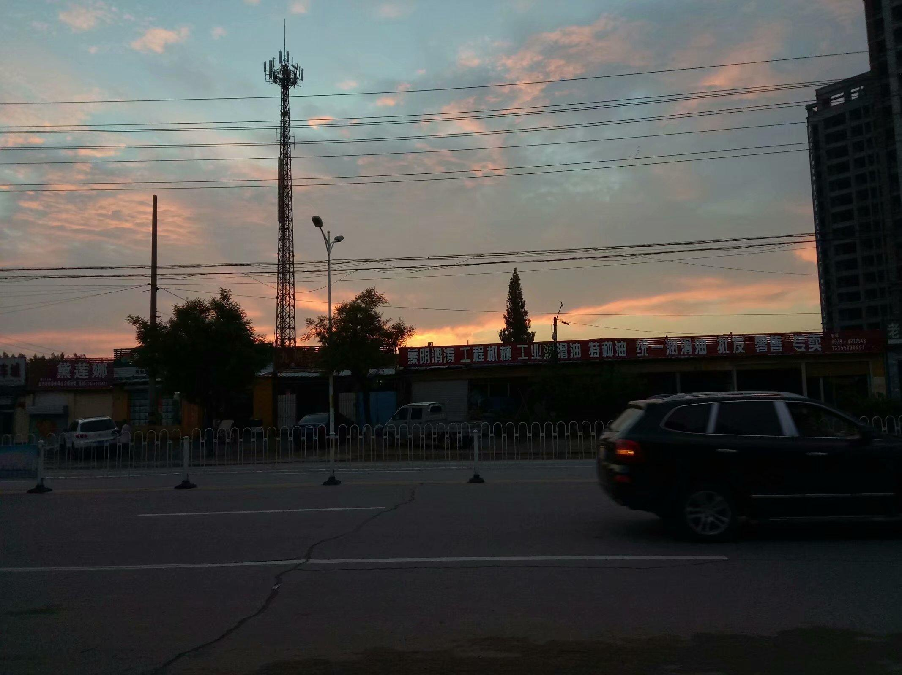

​	我们打着手电筒,慢慢地骑着,即使为了找个休息的地方,也是为了明天减轻些负担.因为明天,是我们打算到日照的日子.

​	大概是晚上十点多吧,我们骑到了一个湖旁,准备在那附近露营.恰巧有条路通往湖的一个岛上,便去了那儿.岛上有个小庄,不大,更多的应是桃,周围全部是桃园.在一桃园小路间的尽头,我们扎好了帐篷.

​	周围飘荡着水蜜桃的清香,回荡着青蛙的鸣叫.抬头向上看,鱼鳞似的云彩向南快速飘动着,其中渗出缕缕月光.

​	夜深了,人静了,也该睡觉了.

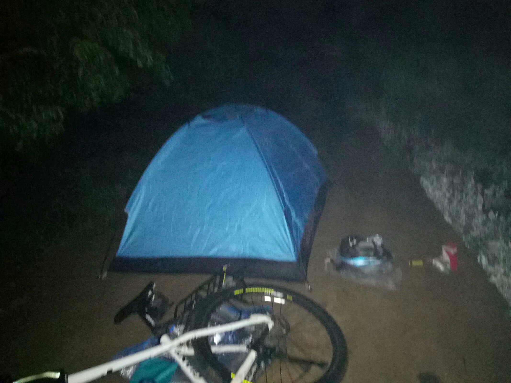

## 第三日,悠闲又紧张的赶路

***

​	凌晨是在帐篷的晃动中醒来的.谁晃的帐篷?是早起来摘桃的果农啊.从帐篷中出来,外面飘着阵阵水汽,帐篷上面全是水珠,仿佛下过雨一般.

​	我们的帐篷挡住了他们的路,我们赶紧收拾,好让他们过去.

​	清晨是凉爽的,潮湿的,空气异常清新,在这种环境中骑车,真是无比的惬意.

​	走着走着,便遇到一条清澈见底的小河.我们走下去,脱了鞋袜,踩在河底光滑的鹅卵石上,感受着湍急的河水从小腿旁流过的力道和冰凉,仿佛身体上的每一个细胞都处于极度的放松与惬意之中.

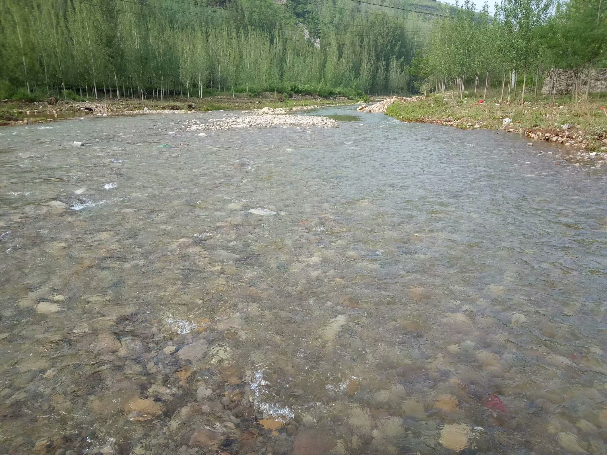

​	淌完水后,便去扔石头打水漂.青山绿水,伴随着洁白的水花和我们的欢笑.

​	太阳出来后,天气很快就热了起来.以至于到中午时,同伴码表上的显示屏竟因过热将所有的字符都显示了出来.

​	来一碗莒县羊汤,吃上几块饼,伴着点咸菜,吃在肚里甚是舒坦.

​	饭后骑了差不多有一个小时,酷热,曝晒,加之昨晚睡觉时间短,骑着车子便有了想要立马睡着的感觉,只是感觉眼皮忍不住地往下掉.

​	我们去买了袋装的咖啡,直接将粉末吃掉,只是并不解困.旁边的健身器材也在太阳的炙烤下让人不敢触摸.

​	最后干脆在一石碑的背面眯了几十分钟,便又继续赶路.

​	之后碰到了桥梁施工,绕了不近的路才过去,耽误了不少时间.

​	绕过这段路后,太阳已经跑到了西边,前方路途还很遥远,今晚,便将走完.

​	天黑了,离日照还是很远的,但如果要骑下去,零点之前还是可以到的.

​	赶夜路是极其危险的,看不清周围环境,也看不清路面.

​	一次,在一个坡冲下来的时间,忽然,路中间冒出了几颗玉米秸秆,我急忙刹车,但已无济于事,直接就撞了上去.但好在并没什么事,只是后怕,若秸秆后面是个大坑怎么办.

​	道路上空无一人,只留我俩在拼命赶路.忽然远方的天空出现一抹蓝光,或许是城市吧.但走进才知道,那只是一个特别大的广告牌发出的光而已.

​	大概又骑了个把小时,天边又隐隐显出红光,没错,那一定就是我们要到的地方了.

​	向着那东方的红光,在被我俩"承包"了的坑坑洼洼的旧柏油路上骑着.

​	那红光越来越亮,越来越清晰,直到我们看到一片高楼,那红光便笼罩在这城市上方.

​	日照,我们到了.

## 第四日,在日照的一天

***

​	今日并没起早,只是想要歇一歇,玩一玩.去买了点润滑油和一套工具,便去了海边.

​	老远就闻到海的咸腥味,在跨过一个大桥后,便真正地到海边了.

​	海是那么蔚蓝与辽阔,浪花扑上沙滩,拍打礁石,在一声声浪花声中,见证了我们遭受的困难和得到的快乐.	

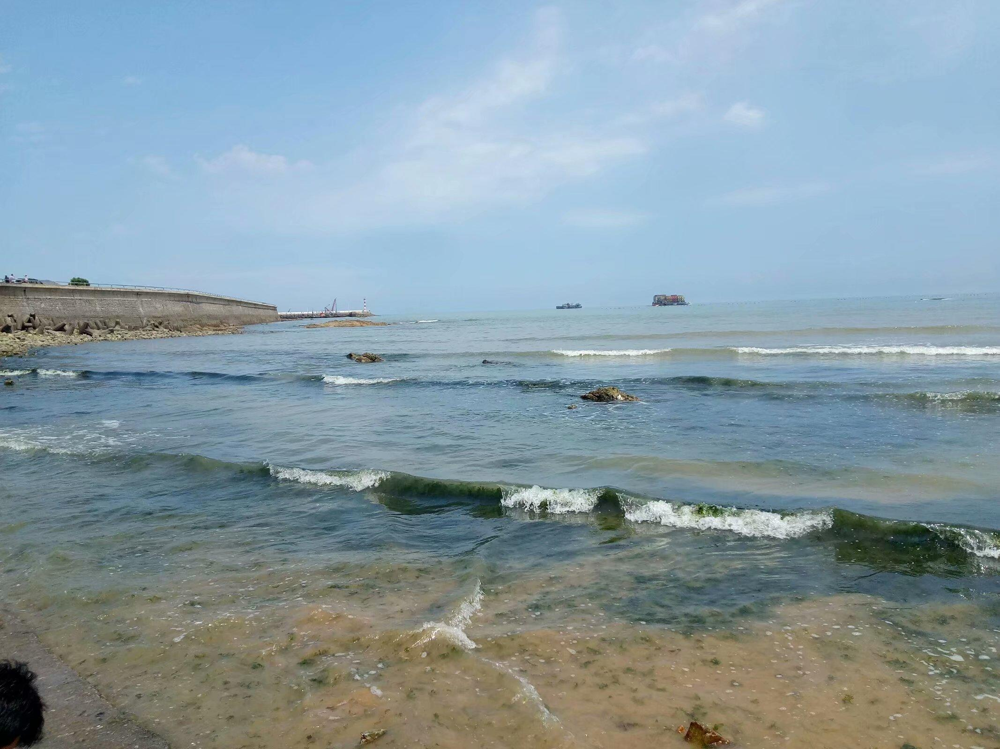

​	换上拖鞋,走上沙滩,捡一只贝壳,捉一只小鱼,如此简单,又如此快乐.	

​	中午,自然是去吃海鲜.只是让人苦笑不得的是,这顿饭的最后,还是用两盆子面条把自己填饱的.而且我们硬生生地被昂贵的大龙虾给弄穷了.	

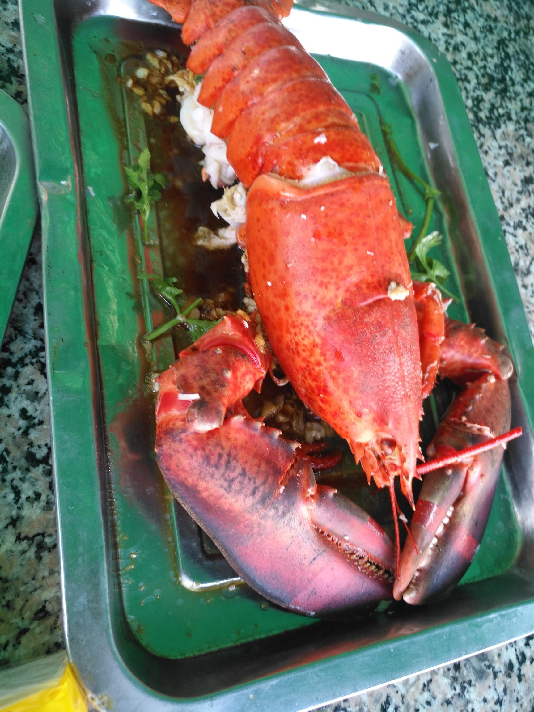

​	下午依然去了海边,在帐篷里换上泳裤,便一头扎进了大海的怀抱.尴尬的是,我并不会游泳.无所谓好了,来玩玩吧.

​	太阳逐渐向西,潮水逐渐上涨,我们离开沙滩,到岸上来.背后是蔚蓝的大海,海风吹拂,巨大的浪花打向海岸,在闪光灯的照射下,我们举着车子,留下了这次骑行标志性的一照.

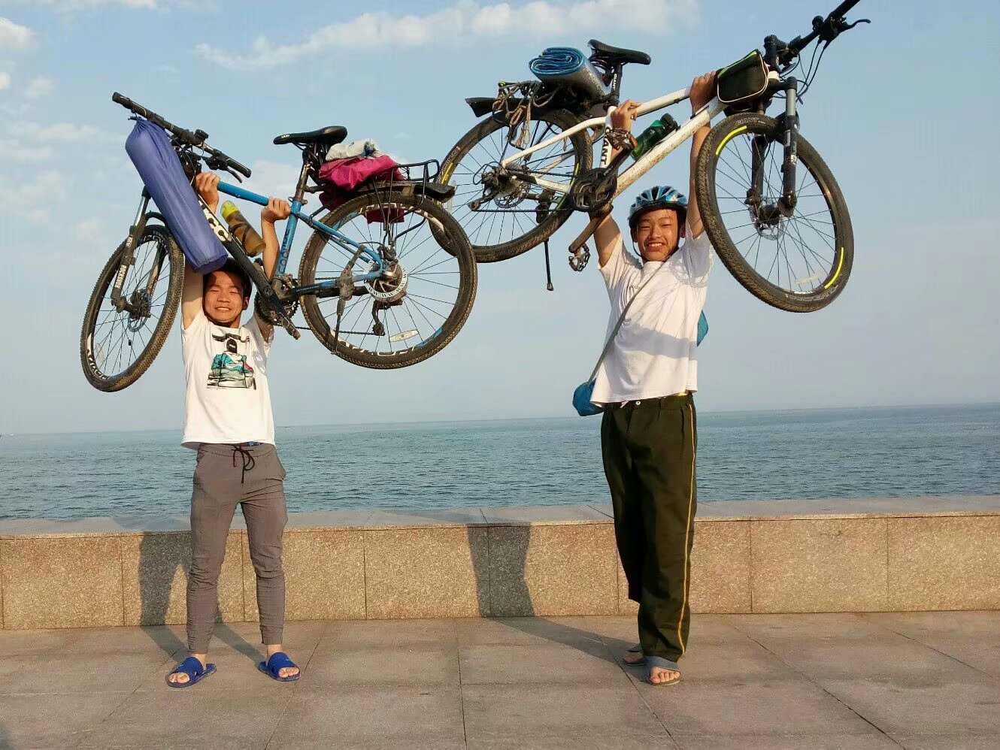

​	晚上,漫步在夜晚的日照街头,悠闲的,嗅着海风,看着如此美丽的夜景.

​	桥上有很多人在拿着网捉着什么东西,一问才知道,原来是在捉水母,在灯光的映射下,透明的水母映出蓝光,不断吞吐着海水,上下漂浮着.

​	高楼大厦既在天上,又在水中,五彩的霓虹灯,在波光粼粼的水面上荡漾,远处的暖黄色路灯连成灯带,带来温暖的气息.

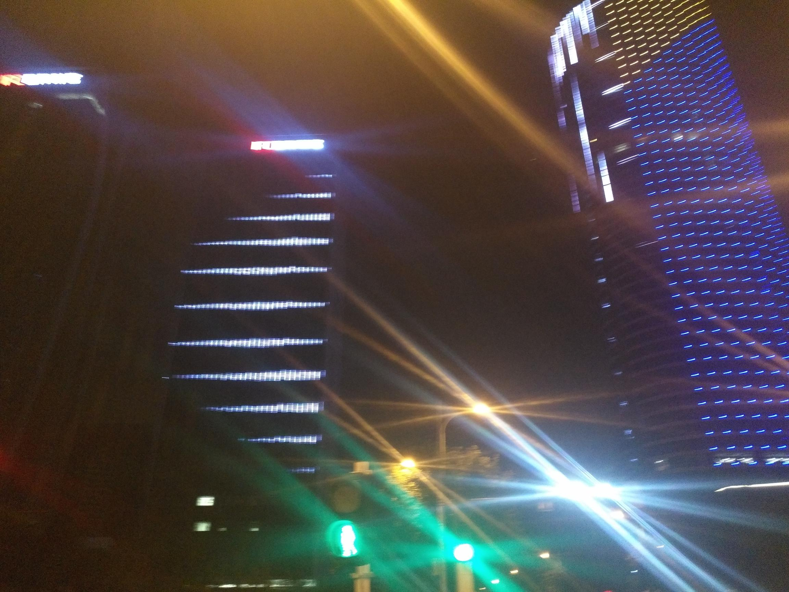

​	回到宾馆,同伴对我说,要不要明天去青岛,要说去,那肯定去啊.

​	明天,赶路去青岛.

## 第五日,至黄岛

***

​	房间里没有窗户,没有按时起床,醒来时已经接近中午了.收拾一下,便出发了.

​	大概只走了五公里,看到一家餐馆,便去吃饭去了.大概两点,便又出发了.

​	现在回忆起来,只觉那天下午的路又近又远.在滨海大道上走了大概两个小时,可能也不到.便经一小路转向了一省道或国道上了.记不太清,只记得那离开滨海大道的地方有一森林公园,在后来进入了的那条路上时,还看到了战机在我们头顶上飞.

​	很快便离开了那风景还算优美的大道,转入了一条省道.通过这条省道,便可以到黄岛了.几乎所有的困难都是在这条路上出现的.

​	路况其实还挺好的,但是很让人不爽的是走上几十里都找不到一个超市.只在一加油站买了几瓶饮料后悠闲地喝了一杯,便又继续赶路了.

​	大概在七点的时候,看到了一个牌子,上面写着市区,黄岛市到了,里青岛只隔一个胶州湾了.只是着市区着实有点大.大到令人诡异.

​	走着走着便进了山,爬坡一向是一个艰巨的任务,骑不动了,便推着向前走.身旁重型卡车的发动机隆隆地发出声响,似乎下一秒发动机就要爆炸,车速很慢,稍微一走快就能追上汽车.远处的建筑物上闪着红灯,在发动机的轰鸣声中,我们走过了一个又一个坡.

​	下面的这段路,走得那真叫一个胆颤心惊.晚上九点多,走上了那条最让人害怕又让人难忘的一条路----S398.

​	起初那条路非常宽阔,双向四车道还有应急车道,只是在上了一个坡后便不是这样了.变为了双向两车道,没有应急车道和人行道.大车特别多,错车变成了一件极其危险的事.只记得有一次,一辆挂车与一辆混凝土搅拌车正错车,而我刚好搅了进去,三辆车并排走在这狭窄的路上,我车把左侧二三十厘米处便是一辆重达约四五十吨的汽车,右侧二三十公分便是沟,还好并没有出什么事,没有月亮,加之手电筒没电,视线变成了最大的问题,只能沿着那白线,每走一米都提心吊胆,生怕一个不小心就载到路边的沟里去.

​	那路走了好远才遇到一个岔路,临离开这条路时,数了一下,几十辆从这儿经过的车,只有一辆没从这条岔路离开这条路.

​	离开了那条路,便松了一口气,慢悠悠地来到了黄岛轮渡码头处.

​	看到海,自然有些激动,在一处海边,我们捉起了螃蟹.

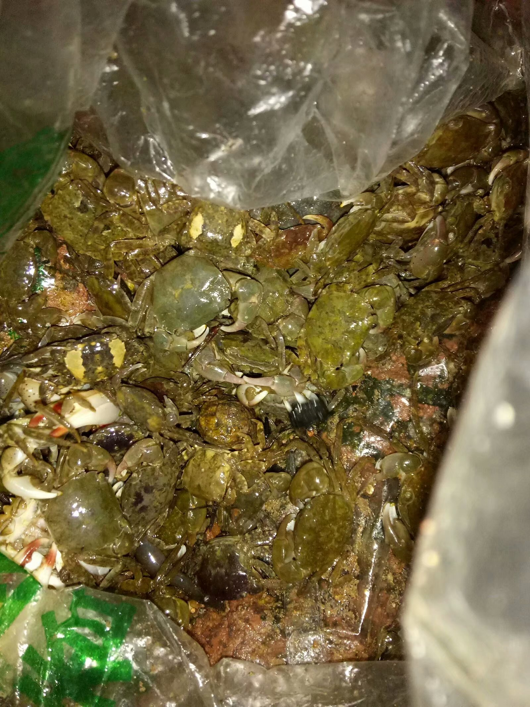

​	海腥味的气体,弥漫在我们周围.远处的船只上闪着灯,众多船只聚在一起,就像天上的星空.

​	浪花离我们越来越近,我们打开装着螃蟹的袋子,即使只螃蟹,争先恐后地向海中爬去.

​	大概到了凌晨三点,在轮渡码头旁的一块地上,铺上个毯子,便作为床了,大雾弥漫的天,便作为被了.	

## 第六日,到达终点

***

​	一个来小时的短暂睡眠,很快便结束了.凌晨四点,天已经亮了,伴着清晨的露水,开始了行动.

​	凌晨四点,街上空无一人,只想找个早餐店,在那吃上一顿再说.

​	大多数的店刚刚有人,还没做好饭,在找了几家之后,便找到了一个刚刚做出饭的地方.吃完饭后,便去赶轮渡去了.

​	大雾,并无轮渡,困意席卷而来,只好在周边找一宾馆睡上一觉,宾馆条件很差,价格也不便宜.

但已管不上这么多,赶快睡觉去了.

​	八点多,太阳当空,雾已散尽,叫醒同伴,便去乘轮渡.说来也巧,我们到了那,便正好赶上一艘船,走了.

​	一声鸣笛,船渐渐驶离了岸,开始向我们的目的地驶去.船很大,可以容纳四百人,在床上转悠一会后,便在船舱处找到了个座位坐下,欣赏海景.

​	约莫半小时,船头方向隐现出一幢幢高楼,越来越清晰,那就是青岛了.

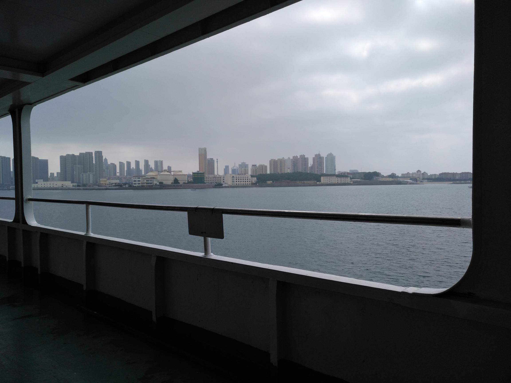

来了青岛,自然要去五四广场.伴着明媚的阳光,车轮再次转动.

​	青岛最让我们烦的,就是它的路了.弯弯曲曲,上上下下.开导航都不太好使,那就凭自己的感觉走吧.

​	海风依旧吹拂着五四广场上的大红色标致,而海边的高楼大厦却早已拔地而起.大海是如此的蓝,空气是如此的清新,阳光又如此明媚.我们的旅程已经走到了尽头,但是,我们的旅行,却只进行了一半.

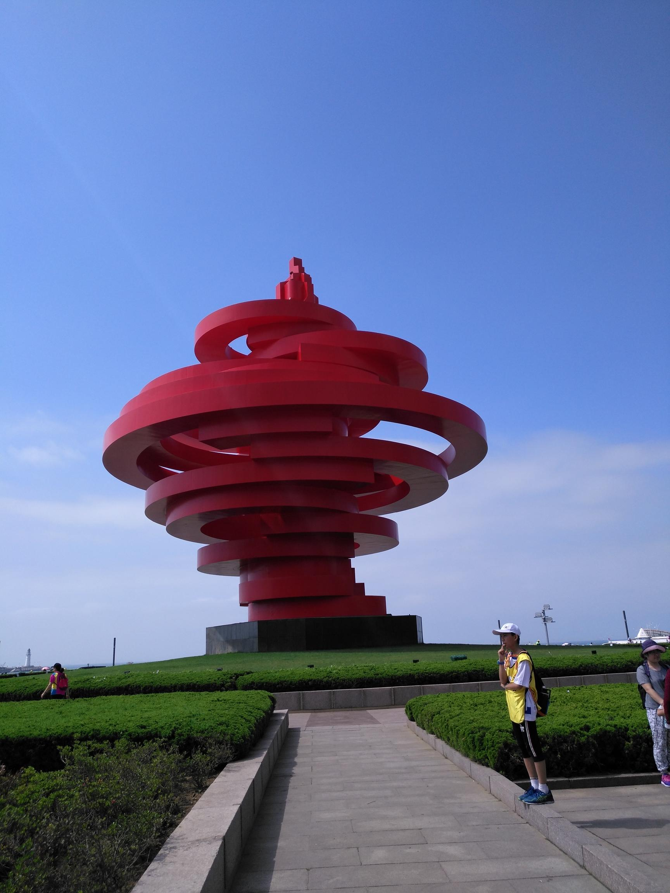	

​	鉴于青岛这么高的物价,加之我们如此大的饭量,我们很明智地选择了自助餐.

​	饭后便去了军事博物馆,看了看当年服役的战机军舰,走后,本想着再去玩些什么,只是价格太高,便离开了.

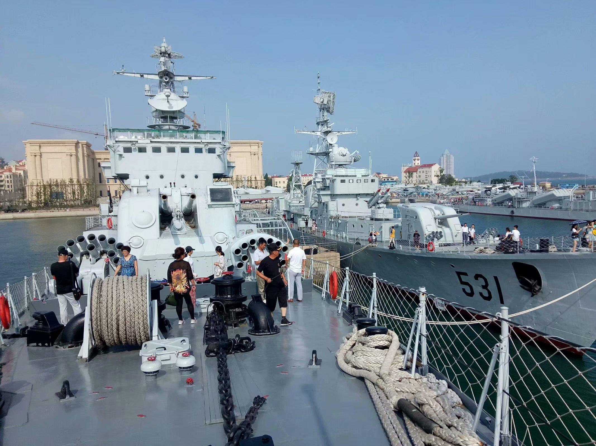

​	傍晚赶轮渡去黄岛,只是后面的几班轮渡都被取消了,究其原因,也只能怪其生意不好吧.毕竟跨海大桥和海底隧道抢了轮渡的太多生意了,可能过几年轮渡就没了吧.	

​	在码头的购票处,我们遇到了同时骑自行车前来赶轮渡的人.只不过,他光着膀子,肤色黝黑,骑着个高粱的大洋车子,车子货架上还有被子轮胎衣服什么的.

​	与他交谈中得知,他是从河北骑来的,山东的一些有名的地方貌似都去过,听他语气,他骑了应该不是两三个月,而应该又一年半载了.见坐轮渡无望,便和他聊了几句,就离开了.

## 第七日,返程

***

​	上午,坐上轮渡,开始了返程.

​	返回,自然要和来时不一样,我们不再原路返回,只是向西去,去看些不一样的风景.

​	返程,少了些欢快.但却多了些星空的别样的氛围.

​	路线并没有规划,只是想着要经过诸城,沂水,莱芜,泰安.

​	聊天,总是在试图打破压抑,带来欢快.我们就这样慢慢地骑,慢慢地聊.

​	看到周围有采摘蓝莓的,想要去,一问,蓝莓园,又离得太远,便走了.

​	便想到我们在青岛买的那盒蓝莓,在轮渡码头旁的菜市场买到的,二十多块钱一斤,但在距离不远的水果店,便要一百多元一斤,或许这儿的蓝莓只有十几元一斤吧.价格差的着实有点大.

​	傍晚,我们聊到了抓金蝉的事,便打算晚上抓一些.	

​	天色渐晚,路边的林子中时不时地闪出几束光,那定是出来抓金蝉的人了.买上个胶带,便想着在晚上好好地弄上一次,抓些金蝉来.	

​	又走了些时间,便停在了一个林子前,今晚就在这里安营扎寨吧.只不过,令人失望的是,这林子里的数的年龄还是太小了,并没有金蝉,在我们想要搭帐篷睡觉时,一个癞蛤蟆跳了出来,看到地上并不太干净,便离开了,找个宾馆住下.	

## 第八、九日,梦中的梦

***

​	如今回想起那段骑行经历,就像梦一般.而这两日,便就像骑行中的梦一样.

​	像梦一样朦胧,总是回想不太清自己当时做了什么,更准确的说,并不太清楚自己先做了什么,后做了什么,只剩下几个无序的片段,留在脑海里,只记得在沙沟,路旁的山上,寻找着泉眼,而又想起,在一条路旁的亭子里,铺上垫子睡的那一觉,只记得自己费力地上坡,又快速地冲下,但却始终无法将其串联起来.

​	像梦一样美好,我知道,那段路是在山里走过的,上坡艰难,加之骑行天数多,累是肯定的.然而,回想,并不是那样,感觉不到一丝劳累与痛苦,有的仅是其中夹杂着的快乐,还清晰地记得我们当时的欢声笑语.

​	像梦一样梦幻,在山中穿梭,伴着流水,映着群山,那水,时而化为激流,时而变为瀑布,而是又沉静下来,默默地流着.景色宛若梦中的,最美的憧憬.

​	那儿经济并不发达,但依旧令人向往.那儿还可以看到石磨.很多地方都没有4G信号,正因如此,才能留下如此美妙的事物----淳朴的人们,浓厚的乡音......

​	第九日晚,走出群山,到了莱芜.

## 第十日,深夜中的梁山城

***

​	再次背对着朝阳,踏上了行程,今日是打算回到梁山的日子,但距梁山,仍有200KM.

​	喝完羊汤,带着满身能量,开始了上午的骑行.

​	中午,到泰安去.

​	上午总体来说,还是挺不错的,骑行速度也比较快,完成了既定任务.

​	吃饱,喝足,再在公园的躺椅上睡上个午觉,便开始了最后,也是最艰难的骑行.此时距梁山还有一百二十千米.	

​	一个下午和晚上完成一百二十千米,是个异常艰巨的任务.

​	只记得很快便进入东平界了,但要出去,便没那么容易了.平时也没觉得东平有多大,这次才真正感觉到了.

​	到了东平,已经很晚了,离梁山却还有六十千米.最后这段路要怎样,却不知如何.	

​	躺着路边的座位上,戴上手套,用面罩蒙上脸,睡了一觉.一个小时后,手机闹钟响起.醒来,继续骑.说来也奇怪,这一觉过后,似乎并不再累了,腿也不再疼了,好像又充满了精力一样.而同伴却并不像我一样,疲倦,劳累,疼痛席卷着他.他说:"你先走吧,我先歇会,停半个小时你再打电话给我,我去追你."但最后并没有追来.

​	独自上路,不再有任何犹豫,只为在今晚走完这最后的六十公里.纵然东平这片来过几次,但因黑夜,也竟不识路了,只好跟着导航走.但导航并不是那么完美,拐了几个弯后便把我带到了小路上.

​	月亮照在了小路上,路两旁是黑洞洞的树林.没有害怕,有的只是向前.

​	体力依旧充沛,好像第一天骑车的样子.到了梁山界,便可关掉导航了.

​	凌晨三点多,在一团红光的笼罩之下,梁山城出现在了我的眼前.梁山,到了.

## 后记

***

​	第十一日中午,同伴从东平来到,旅途正式结束.共走过一千二百公里.

​	开始写到现在,已过去一月多.骑行也结束了三个多月了.从六月二十六号开始,到七月六号结束,这其中,是我经历过最有意义的活动,从那之后,便一直想着再骑一次,但却不再有时间了,写下这事,留以纪念

​													11月10日
